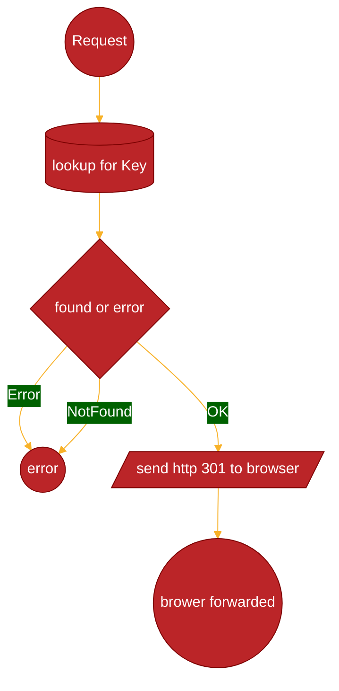
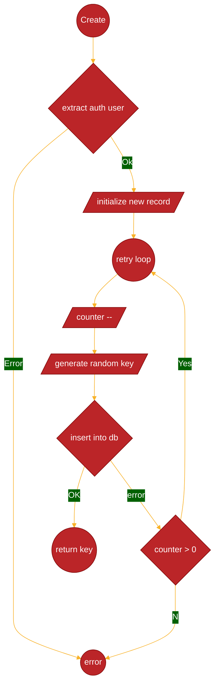

# URL Shortener service task

## Task requirements

* A RESTful web service that allows users to POST a URL and receive a short URL in return, or GET a short URL and be redirected to the original long URL.
* A web app for users to access the service's features.

## Task details

* the service should be easy to deploy in the cloud (AWS, Heroku, or similar)
  * Since it is containerizes it will be very easy to do so.
* use a language of your choice to build the service; feel free to use additional libraries as needed
  * Golang for all backend
* use a database of your choice to store the service's state
  * PostgreSQL as it is the most common and easy to implement, but not the best option in some user cases (please see bellow)
* take as much time as you need to complete the assignment, but somewherebetween 3 and 6 hours of time sounds about right
* if you have any questions about the assignment, please contact me.

## Some assumptions

* URL will be stored forever (no expiration of any short url)
* Each short URL will be based on `<BASE_URL>/<URL_KEY>`
  * `base_url` will be the hostname of the service, since this value depends on the hosting and actual deployment details, the actual value will be set by the frontend of the system.
  * `url_key` will be alphanumeric string of not more than 12 characters
* We don`t care if a user creates already existing long URL.

## Some design options

1. For ID we will use random generator based on time.
2. We will use BASE62 encoding to generate the `URL_KEY`, so this will allow of total ~10^62 short URLs stored in the system ( BASE62 encoding is using a-z, A-Z, 0-9)
3. If the URL_KEY exists we will attempt multiple times ( current 10 times)
4. We will use one table for storing generated short `URL_KEY`s
   1. Each short `URL_KEY` will be as primary column
   2. Owner id for tracking who can update/delete the record
   3. original URL e.g. long URL
   4. timestamp of creating/updateing the record
5. We will use one dummy table for username/password authentication. The login call will generate `TOKEN` value, this value then must be used as HTTP HEADER: `Authorization: Bearer <TOKEN>`, please see [Makefile](/Makefile) for examples.

## Out of scope, but also good to consider

* We can assume that for each created short URL there will be multiple ( more ten 100) request to read this short URL, so a caching system could be a huge benefit for the performance of the system.
* History of updated/created/deleted records.
* Metrics/tracing data for monitoring and troubleshooting the system. [Opentelemetry](https://opentelemetry.io/) could be used for both.
* We can use other then PostgresSQL database for storing short URLs also depends on the other non functional requirements:
  * If we are looking for highly distributed system we can use
    * We can use DynamoDB (AWS service), this is distributed, high available database, provided by AWS
    * CassandraDB/Scylla DB is also very good drustributed database, which can handle high `insert` traffic, can be self managed.

## Install

* Apart from GoLang 1.23.+ you will need to following for local development
  * Standard *nix make utils
  * [Docker](https://docs.docker.com/engine/install/)
    * other options of docker are also possible which can be used for building of images
  * [docker compose](https://docs.docker.com/compose/install/)
  * [JSON Query](https://jqlang.org/download/)
  * [Linter](https://golangci-lint.run/welcome/install/) 
  * [Node + npm](https://docs.npmjs.com/downloading-and-installing-node-js-and-npm)

* Run it localy
  * Start local postgres
    * `docker-compose up -d postgres`
  * Set env variables

    ```bash
    export DB_HOST=localhost
    export DB_USERNAME=test
    export DB_PASSWORD=test
    export DB_DATABASE=test
    ```

  * Start main.go

    ```bash
    $ go run be/shorturl/cmd/main.go
    2025/02/06 00:10:22 INFO Connect.Open host=localhost:5432 database=test
    2025/02/06 00:10:22 INFO Start ListenAddr=:8080
    ```

* UI based on [VueJS](https://vuejs.org/guide/introduction.html) [VuetifyJS](https://vuetifyjs.com/en/)
  * Run locally

    ```bash
    cd ui
    npm install
    npm run dev
    ```

## Repository structure

* [backend dockerfile](/be.Dockerfile) Dockerfile for building image
* [docker-compose](/docker-compose.yaml) Compose file for testting and local development
* [Makefile](/Makefile) Make targets
  * Targets for build/tests/linter
    * go_build - build docker image
    * go_test - run backend tests
    * go_clean - clean go cache
    * go_lint - run go linter
    * go_run - run service locally
  * Targets for testing the app locally (make sure you have started the `go_run` target)
    * login - sends LOGIN request to the system
    * url_add - sends `POST` request to Generate new short URL
    * url_list - Sends `GET` request to `admin/v1` endpoint to fetch all records for current user ( only `admin` )
    * url_delete - Sends `DELETE` request to `admin/v1` with hardcoded `URL_KEY`
    * url_forward - sends `GET` request to `/<KEY>` ( hardcoded KEY value)
* [golang backend](/be) - All GoLang backend code
  * [common](/be/common) - common package which can be re-used in other services
    * [application](/be/common/application) - General application models ( errors only for now)
    * [logging](/be/common/logger) - logging
    * [roles](/be/common/roles) - Tooloing for authentication and authorization
    * [system](/be/common/system) - general `startup` and `shutdown` function
    * [web](/be/common/web/) - general tooling for all HTTP/WEB traffic, router, middleware etc...
  * [login](/be/login) - Very basic user/password service for authorization
    * [api](/be/login/api) - RESTFul api entrypoint/router
    * [models](/be/login/api) - Public models (used by API) which can be shared between services
    * [app](/be/login/app) - Business logic implementation
  * [shorturl](/be/shorturl) - The actual service for Short URL service
    * [cmd](/be/shorturl/cmd) - Main entrypoint
    * [models](/be/shorturl/models) - Public models (used by API) which can be shared between services
    * [api](/be/shorturl/internal/api) - RESTFul api entrypoint/router
    * [app](/be/shorturl/internal/app) - Business logic implementation
    * [keygenerator](/be/shorturl/internal/keygenerator) - Unique key generator
    * [repo](/be/shorturl/internal/repo) - Models and interfaces related to CRUD operattions
    * [Postgres](/be/shorturl/internal/repo/pg) - Implementation of repo for PostgreSQL database
* [ui](/ui/) - VueJS with Vuetify
  * [HelloWorld](/ui/src/components/HelloWorld.vue) - Main file with our UI compoments
  
  Very limited UI with very poor quality, as my knollage in UI is very limited.

## Diagrams

### Forwarding to the actual URL



### Since the creating new short URL is a bit tricky here is a block diagram


